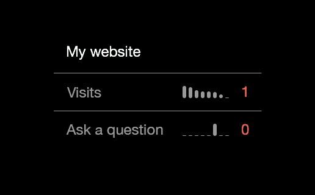

# Google Analytics account summary

This is a widget for [Übersicht](http://tracesof.net/uebersicht) that displays a summary of a [Google Analytics](http://google.com/analytics) account: visits and goal reaches for the last week grouped by day. Mini charts are generated for each goal and the number of visits. Today's visits and goal reaches number are displayed in color: red for value lower than yesterday's, green otherwise, white if unchanged.




## Setup

### Important note

Since analytics.rb script uses [Bundler](http://bundler.io) these steps are required prior to others:

1. Move widgets folder so there are no non-ASCII characters in path, e.g. /Users/someuser/uwidgets and update Übersicht settings accordingly.
2. Execute `bundle install` command In the widget folder.
3. Update command line in the *ga.coffee* script so it matches your system configuration:

`command: "cd ga.widget; <full path to bundle command>/bundle exec ruby analytics.rb"`

### Setup steps

1. Register a [Google](http://google.com) account and setup a [Google Analytics](http://google.com/analytics) code on your website.
2. In the *APIs & auth - Credentials* section create a new *Client ID* and generate a new *P12 key*. At this step you get some credentials from Google: service account email, P12 key file and a password to unlock it.
3. Got to your Google Analytics account and give the service account email access to the profiles you want.

After completing these steps you should have following data at hand:

```
service_account_email = 'xxxxxxxxx@developer.gserviceaccount.com' # Email of service account
key_file = 'xxxxxxx.p12' # File containing your private key
key_secret = 'notasecret' # Password to unlock private key
profileID = 'xxxxxxxx' # Analytics profile ID
accountID = 'xxxxxxxx' # Analytics account ID
propertyID = 'UA-xxxxxxxx-x' # Analytics web property ID
```

Update these values in *analytics.rb* script. You might also like to update resource name in *ga.coffee* for convenience:

```
render: (output) -> """
<div class="resource-name">My website</div>
<div id="items">
</div>
"""
```
