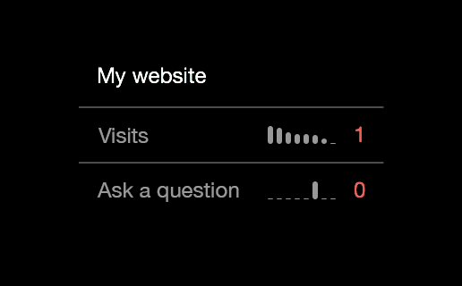

# Yandex Metrika account summary

This is a widget for [Übersicht](http://tracesof.net/uebersicht) that displays a summary of a [Yandex Metrika](http://metrika.yandex.ru) account: visits and goal reaches for the last week grouped by day. Mini charts are generated for each goal and the number of visits. Today's visits and goal reaches number are displayed in color: red for value lower than yesterday's, green otherwise, white if unchanged.




## Setup

### Important note

Since *metrika.rb* script uses [Bundler](http://bundler.io) these steps are required prior to others:

1. Move widgets folder so there are no non-ASCII characters in path, e.g. /Users/someuser/uwidgets and update Übersicht settings accordingly.
2. Execute `bundle install` command In the widget folder.
3. Update command line in the *ym.coffee* script so it matches your system configuration:

`command: "cd ym.widget; <full path to bundle command>/bundle exec ruby metrika.rb"`

1. Register a [Yandex Metrika](http://metrika.yandex.com) account and setup a counter on your website.
2. Register an application at https://oauth.yandex.com/client/new.
3. Get an auth token as described at http://api.yandex.com/oauth/doc/dg/tasks/get-oauth-token.xml.

After completing these steps you should have following data at hand:

* Application Id
* Application password
* Auth token
* Counter Id

Update these values in *metrika.rb* script. You would also like to update resource name in *ym.coffee* for convenience:

```
render: (output) -> """
<div class="resource-name">My website</div>
<div id="items">
</div>
"""
```
